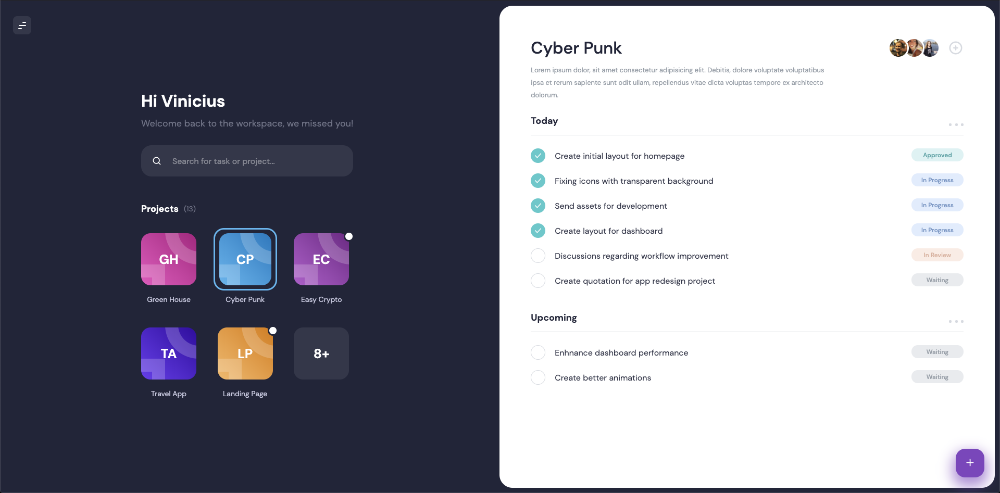

<p>
  
  <a href="#" target="_blank">
    
  </a>
  <a href="https://twitter.com/vinicius98s" target="_blank">
    
  </a>
</p>

> This is a dashboard for task managements made with React and TypeScript inspired in a [Dribbble shot](https://dribbble.com/shots/6816310--Exploration-Dashboard-for-Task-Management)

## Install

```sh
yarn install
```

## Usage

```sh
yarn start
```

## Preview



_PS: It's not responsive at all_

## Author

👤 **Vinicius Sales**

- Website: https://viniciussales.com/
- Twitter: [@vinicius98s](https://twitter.com/vinicius98s)
- Github: [@vinicius98s](https://github.com/vinicius98s)

## Show your support

Give a ⭐️ if this project helped you!

---

_This README was generated with ❤️ by [readme-md-generator](https://github.com/kefranabg/readme-md-generator)_
